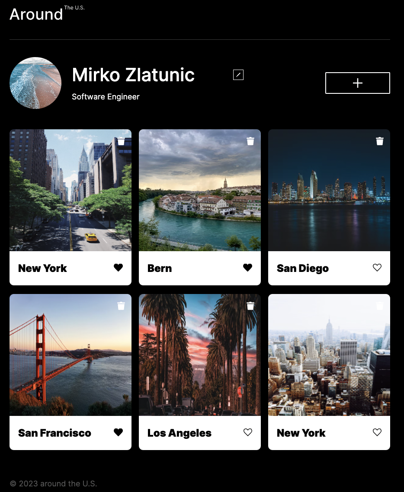
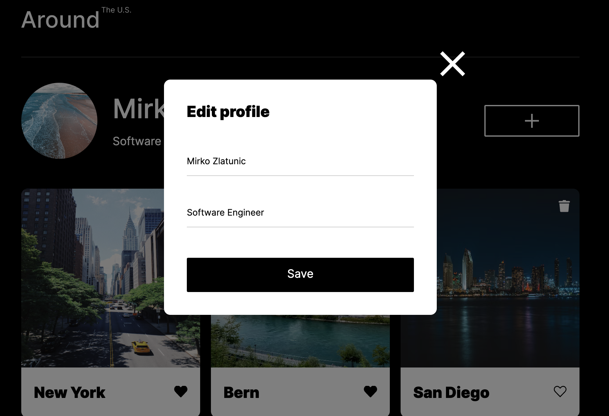
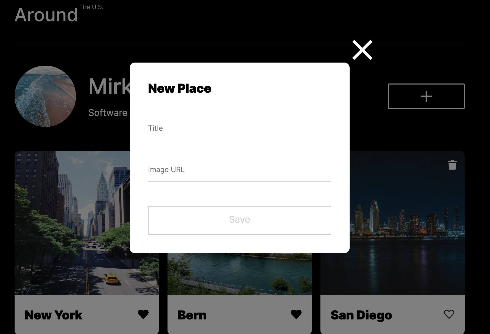
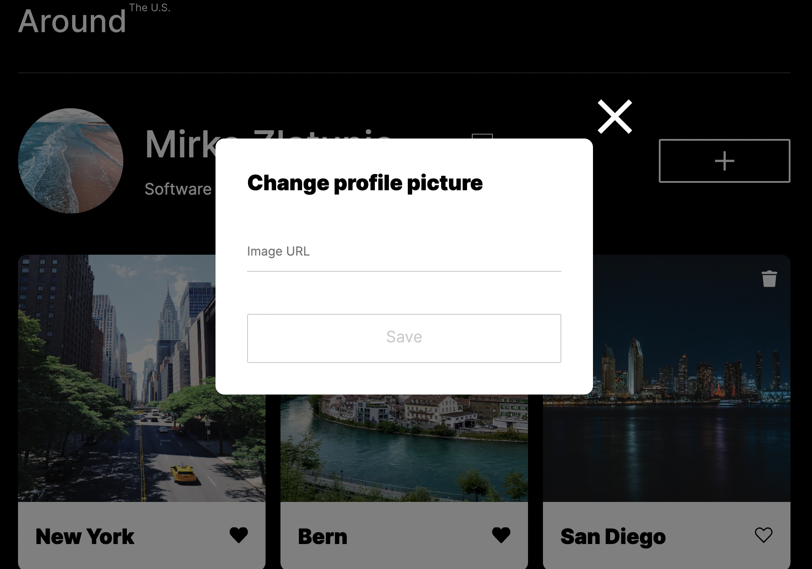
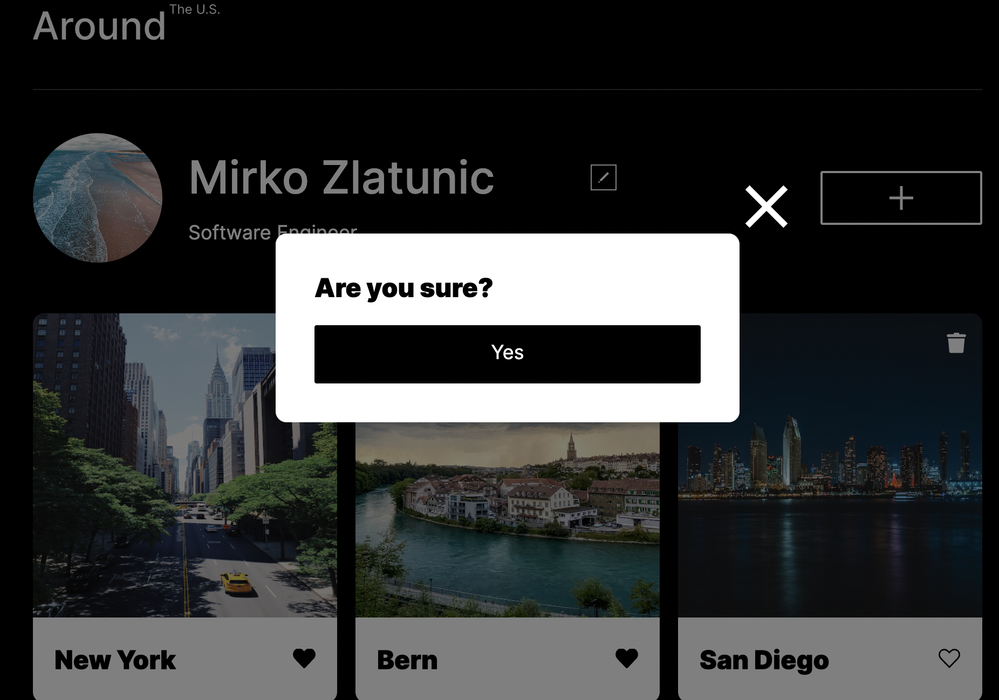

# Practicum Project Around The U.S.

This is a project from Practicum of the Web Development program. It was created using HTML, CSS and JavaScript based on the Figma design layout. The web page is responsive, so it has been designed for both desktop and mobile devices. Photos have been optimized using "TinyPng" (https://tinypng.com/).

## Screeshot

Home Page

Edit Profile Modal

Create new Card

Change Profile Picture

Delete Card

## Figma

- [Link to the project on Figma](https://www.figma.com/file/E5x6ib3osaUUNwLRRAsTDX/Sprint-9-%E2%80%94-Applied-JavaScript?node-id=1530%3A2&mode=dev)

## Technologies

- HTML
- CSS
- Figma
- BEM
- JavaScript
- Git
- JSON
- Webpack
- GitHub
- Fetch API

## GitHub Page

- [Link to the Github Page](https://mirkozlatunic.github.io/se_project_aroundtheus/)

**Created By [Mirko Zlatunic](https://github.com/mirkozlatunic)**

## Improvements

- [x] Preview Image Footer adapt to same as Card for more visibility
